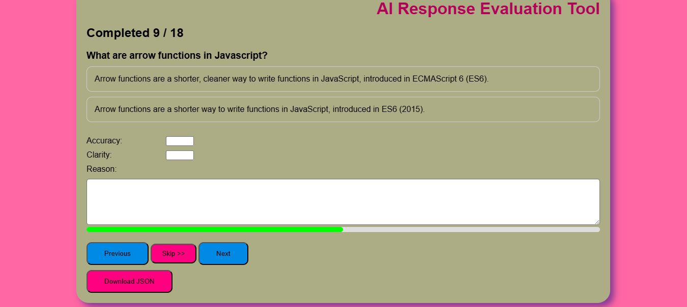

# 🧠 AI Response Annotation Tool

## Project Overview

A browser-based annotation tool for evaluating and labeling AI-generated responses using structured scoring.
Built to simulate real-world AI data labeling workflows used in training datasets.

# DASHBOARD



## 🚀 Features
- ✅ Compare two AI responses (A vs B)
- ✅ Select best response with visual feedback
- ✅ Score responses based on:
  - Accuracy (1–5)
  - Clarity (1–5)
- Reasoning (text input)
- ✅ Keyboard shortcuts (A / B / Enter) for faster annotation
- ✅ Navigation controls:
  - Next
  - Previous
  - Skip
- ✅ Edit mode (revisit and update previous annotations)
- ✅ Progress tracking with visual progress bar
- ✅ Persistent state using localStorage
- ✅ Export annotations as structured JSON dataset


## 🛠️ Tech Stack
- JavaScript (Vanilla JS)
- HTML5
- CSS3


## 📂 Project Structure
```
project-folder/
├── images/
│   └── screenshot.png
├── index.html
├── app.js
├── style.css
├── data.json
└── README.md
```

## ⚙️ How It Works
1. Loads dataset from data.json
2. Displays:
    - Prompt
    - Two AI responses (A & B)
3. User:
    - Selects best response
    - Assigns scores
    - Provides reasoning
4. Annotation is saved to localStorage
5. User can:
    - Navigate between items
    - Edit previous annotations
6. Final dataset can be downloaded as JSON


## 🧪 Example Data Format (data.json)
```js
[
  {
    "prompt": "What is Artificial Intelligence?",
    "responseA": "AI is the simulation of human intelligence in machines.",
    "responseB": "AI is a robot that thinks like a human."
  }
]
```


## 📤 Output Format (Annotations)

```js
{
  "id": 0,
  "prompt": "What is Artificial Intelligence?",
  "responses": {
    "A": "AI is the simulation of human intelligence in machines.",
    "B": "AI is a robot that thinks like a human."
  },
  "evaluation": {
    "best": "A",
    "accuracy": 5,
    "clarity": 4,
    "reason": "Response A is more precise and technically correct."
  }
}
```


## ▶️ Running the Project

⚠️ Important: This project uses fetch() to load data.

Option 1 (Recommended)

Use a local server:

  - Install Live Server in VS Code
  - Right-click index.html
  - Click "Open with Live Server"
Option 2

  - Use any local server (Node, Python, etc.)


## 🎯 Use Cases
  - AI data annotation practice
  - Training dataset creation
  -  Prompt/response evaluation
  - Learning frontend state management

## 👨‍💻 Author

Nkululeko A. Gumede

  - Aspiring AI Trainer | Data Annotator & JavaScript Developer
  - Based in Durban, South Africa

## 📄 License

This project is open-source and available under the MIT License.


## 💡 Inspiration

This project was built to simulate real-world AI annotation tools used in machine learning pipelines, focusing on usability, structured data output, and efficient workflows.

## 🔥 Future Improvements
⏱️ Annotation timer (track time per item)    
📊 Analytics dashboard (accuracy trends, stats)   
📁 Upload custom datasets (JSON import)   
☁️ Backend integration (store annotations remotely)   
👥 Multi-user annotation support
